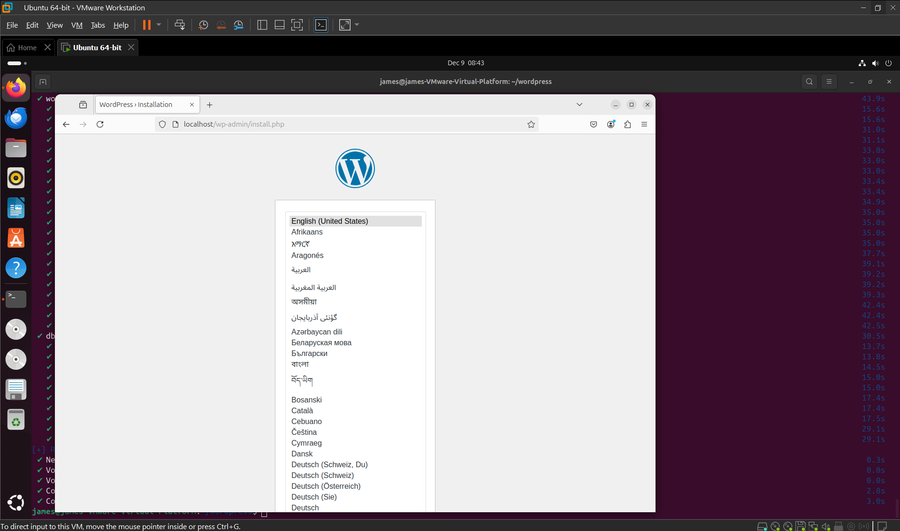

# Docker Compose Lab: WordPress
This is my write-up for the Docker Compose Lab for CYB-3353: Systems Administration

## Step 1: Open VM
I used Vmware Workstation Pro to open an Ubuntu VM.

## Step 2: Install Docker Compose
1. Update and upgrade your packages before installing something new with:
```sudo apt update``` and ```sudo apt upgrade```
2. Docker compose is now a standard part of docker. Install docker with:
```sudo apt install docker.io```

## Step 2: Create a directory for WordPress
Create with
```mkdir wordpress```

## Step 3: Change current directory to the new one
```cd wordpress```

## Step 4: Create docker-compose.yml file
1. ```nano docker-compose.yml```
2. Add the following to the docker compose yml file:
```yaml
services:
  db:
    # We use a mariadb image which supports both amd64 & arm64 architecture
    image: mariadb:10.6.4-focal
    # If you really want to use MySQL, uncomment the following line
    #image: mysql:8.0.27
    command: '--default-authentication-plugin=mysql_native_password'
    volumes:
      - db_data:/var/lib/mysql
    restart: always
    environment:
      - MYSQL_ROOT_PASSWORD=somewordpress
      - MYSQL_DATABASE=wordpress
      - MYSQL_USER=wordpress
      - MYSQL_PASSWORD=wordpress
    expose:
      - 3306
      - 33060
  wordpress:
    image: wordpress:latest
    volumes:
      - wp_data:/var/www/html
    ports:
      - 80:80
    restart: always
    environment:
      - WORDPRESS_DB_HOST=db
      - WORDPRESS_DB_USER=wordpress
      - WORDPRESS_DB_PASSWORD=wordpress
      - WORDPRESS_DB_NAME=wordpress
volumes:
  db_data:
  wp_data:
  ```

  3. Save and close

  ## Step 5: Start Docker Compose
  run
  ```docker compose up -d```

  ## Step 6: Verify WordPress is working
  1. Open a web browser in the VM.
  2. Go to localhost
  3. If the wordpress site is there, then success.   
  

  

  ## Issues encountered:
  I encountered some odd issues with this process. I took almost double the time it took to do everything else as I took to troubleshoot this issue. Whenever I ran ```docker compose up -d``` it would report an unknown flag. I would then remove it and it would then say unknown command `compose`. I was very confused by this and it took quite some time to get everything sorted out. It seems like the version of ubuntu that I was using was too new or something because the version `noble` that I was using wouldn't work. I had to manually install docker compose add ons and utils by using the older `jammy` version. This took about 45 minutes to solve.

  ## Documentation followed:
  As suggested in the assignment, awesome-compose github was a great resource. https://github.com/docker/awesome-compose

  Specifically, I followed the guide at:
  https://github.com/docker/awesome-compose/blob/master/official-documentation-samples/wordpress/README.md